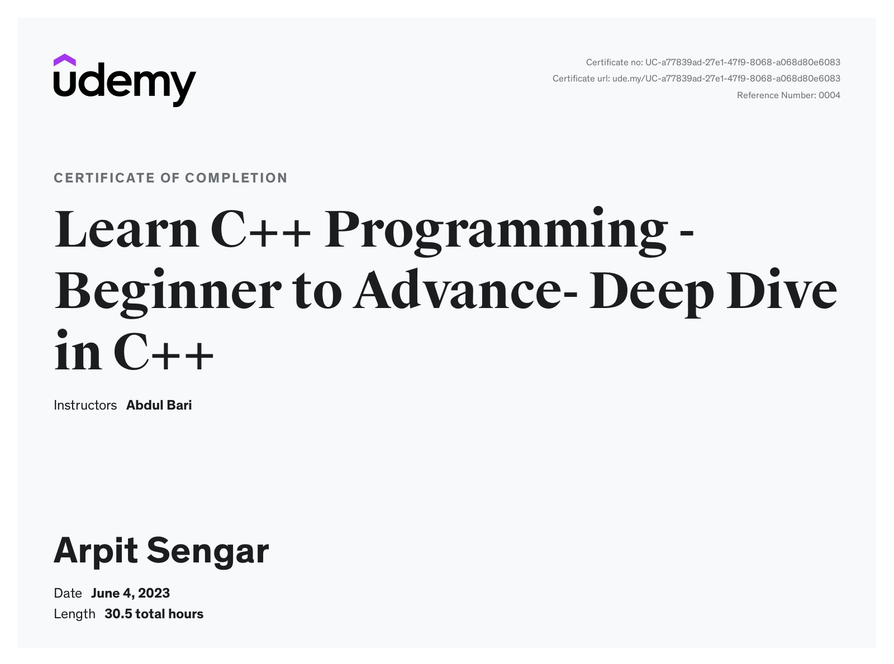

# C++ Journey Documentation

Welcome to the repository documenting my C++ journey! In this repository, I will share my learnings, projects, and resources related to C++ programming as I progress through my learning process. This README file serves as an introduction and guide to navigate through the repository effectively.

## Table of Contents
- [About](#about)
- [Code Snippets](#code-snippets)
- [Project](#project)
- [Personal Notes](#personal-notes)

## About
This repository is created to track and showcase my journey in learning and mastering the C++ programming language. Through this documentation, I aim to provide detailed explanations, code examples, and practical projects to demonstrate my progress in C++.

C++ is a powerful and versatile language widely used in various domains, including systems programming, game development, and high-performance applications. By sharing my journey, I hope to inspire and assist others who are also interested in learning C++.

## [Code Snippets](Code)
The code directory contains a collection of code snippets covering various C++ concepts, techniques, and idioms. These snippets provide concise examples that focus on specific aspects of the language. They are organized into different folders based on the topics they cover.

They are designed to provide a hands-on understanding of different C++ features, from basic syntax to more advanced concepts like templates and object-oriented programming.

## [Project](Project)
In the project directory, you will find a practical projects that I have completed during my C++ journey. These project is designed to exercise and apply different aspects of the language, ranging from basic concepts to more advanced topics.

## [Personal Notes](Personal%20Notes)
Throughout my C++ journey, I have maintained a collection of personal notes to record important concepts, insights, and tips that I have learned. These notes serve as a reference for me and provide a comprehensive overview of my progress.

You can find my personal notes in the notes directory. Feel free to explore my notes and use them as a supplemental resource to enhance your own understanding of C++.

 
Thank you for joining me on this C++ journey! Let's dive into the world of C++ programming and unlock the power to build efficient and powerful applications. Happy coding!

If you have any questions or feedback, please don't hesitate to reach out.

## [Certificate](https://www.udemy.com/certificate/UC-a77839ad-27e1-47f9-8068-a068d80e6083/)
